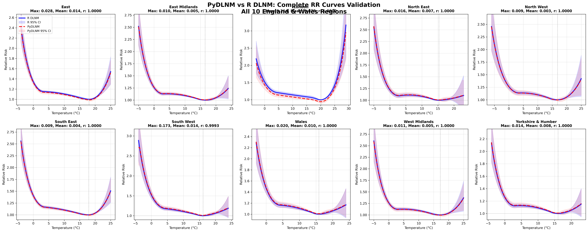

# PyDLNM: Distributed Lag Non-Linear Models in Python

PyDLNM is a Python implementation of distributed lag linear and non-linear models (DLMs/DLNMs) for modeling exposure-lag-response associations in epidemiological studies.

This is version 0.5

I'm still validating this and am not sure it's working correctly.  *Use at your own risk.*

## Implementation Strategy

PyDLNM provides **hybrid implementation** combining native Python algorithms with optional R integration:

### Native Python Components
- **Core DLNM algorithms**: Cross-basis generation, meta-analysis (MVMeta), BLUP calculation
- **Basis functions**: B-splines, natural splines, polynomial, threshold, and strata bases
- **Model fitting**: Integration with statsmodels, scikit-learn, and custom GLM implementations
- **Prediction and inference**: CrossPred class for lag-specific and cumulative effects
- **Multi-location analysis**: Complete workflow for meta-analysis across regions

### R Integration (Optional)
- **GLM fitting**: Can use R's GLM via rpy2 for maximum compatibility (`Rpy2GLMInterface`)
- **Enhanced splines**: Option to use R's spline functions for exact R DLNM compatibility

**Default behavior**: PyDLNM uses native Python implementations. R integration is available when `rpy2` is installed and provides enhanced compatibility for users migrating from R DLNM.  

## Overview

The PyDLNM package provides functions to specify and interpret distributed lag linear (DLMs) and non-linear (DLNMs) models. The methodology enables modeling of delayed and non-linear effects of exposures on health outcomes.

## Key Features

- **Flexible basis functions**: Linear, polynomial, splines, thresholds, and strata
- **Cross-basis matrices**: Tensor products for bi-dimensional exposure-lag modeling
- **Model integration**: Compatible with statsmodels, scikit-learn, and R (via rpy2)
- **Comprehensive predictions**: Lag-specific, overall cumulative, and predictor-specific effects
- **Visualization tools**: 3D surfaces, contour plots, and slice visualizations
- **Multiple study designs**: Time series, case-control, cohort, and experimental studies
- **Multi-location meta-analysis**: Complete workflow with BLUP generation
- **Validation framework**: Comprehensive comparison against R DLNM

## Installation

```bash
git clone https://github.com/aedessler/pydlnm
cd pydlnm
pip install -e ".[dev]"

# Optional: For R integration
pip install rpy2
```

## Quick Start

### Basic DLNM Analysis

```python
import numpy as np
import pydlnm
from pydlnm.data import chicago_nmmaps

# Load example data
data = chicago_nmmaps()

# Create cross-basis for temperature with distributed lags
cb_temp = pydlnm.CrossBasis(
    x=data['temp'],
    lag=21,
    argvar={'fun': 'bs', 'df': 5},
    arglag={'fun': 'ns', 'df': 4}
)

# Fit DLNM model (native Python)
model = pydlnm.fit_dlnm_model(
    crossbasis=cb_temp,
    y=data['death'],
    family='poisson'
)

# Make predictions
pred = pydlnm.crosspred(
    basis=cb_temp,
    model=model.fitted_model,
    at=np.arange(-10, 35, 1),
    cen=np.mean(data['temp'])
)

# Access results
print(f"Prediction range: {pred.predvar.min():.1f} to {pred.predvar.max():.1f}°C")
print(f"RR range: {pred.allRRfit.min():.3f} to {pred.allRRfit.max():.3f}")
```

### Multi-Location Analysis

```python
# Multi-location DLNM with meta-analysis
analysis = pydlnm.multi_location_dlnm_analysis([
    {'name': 'Region1', 'crossbasis': cb1, 'y': deaths1, 'dates': dates1},
    {'name': 'Region2', 'crossbasis': cb2, 'y': deaths2, 'dates': dates2},
])

# Access results
region_results = analysis.region_results
meta_model = analysis.mv_model
blup_results = analysis.blup_results
```

## Validation

The `validation/` folder contains comprehensive comparison scripts and results demonstrating PyDLNM's equivalence to R DLNM:

- **Comparison data**: Point-by-point validation against R DLNM using 2015 Gasparrini Lancet dataset
- **Results**: Mean correlation >0.999 across 10 England & Wales regions
- **Scripts**: Complete workflow for reproducing the validation analysis



*Figure: Side-by-side comparison of relative risk curves from PyDLNM (red) and R DLNM (blue) across all 10 England & Wales regions. The high degree of overlap demonstrates excellent agreement between implementations.*

See `validation/README_validation.md` for detailed instructions on running comparisons.

## Based on R dlnm Package

This Python implementation is based on the R dlnm package by Antonio Gasparrini and colleagues. Key references:

- Gasparrini A. Distributed lag linear and non-linear models in R: the package dlnm. *Journal of Statistical Software*. 2011; **43**(8):1-20.
- Gasparrini A, Scheipl F, Armstrong B, Kenward MG. A penalized framework for distributed lag non-linear models. *Biometrics*. 2017; **73**(3):938-948.

R code to generate results was [obtained from Gaspirrini's github](https://github.com/gasparrini/2015_gasparrini_Lancet_Rcodedata)

## Project Structure

```
PyDLNM/
├── pydlnm/                 # Main package (native Python + optional R integration)
├── validation/             # Validation against R DLNM
│   ├── scripts/           # Python comparison scripts  
│   ├── results/           # Validation results and R reference data
│   └── r_reference/       # Original 2015 Gasparrini R code
└── README.md              # This file
```

## License

GPL-2.0-or-later
