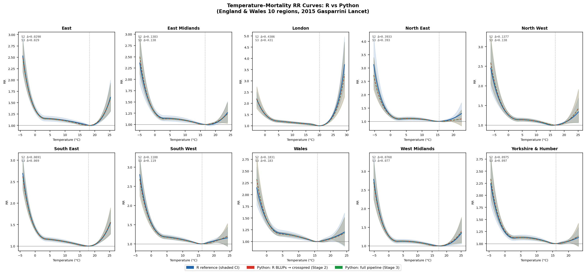

# PyDLNM: Distributed Lag Non-Linear Models in Python

PyDLNM is a Python implementation of distributed lag linear and non-linear models (DLMs/DLNMs) for modeling exposure-lag-response associations in epidemiological studies.

**Version 0.8** — Validated against R DLNM at machine precision across two independent datasets.  Note, however, that errors might still exist.  BE CAREFUL!

## Validation Status

### England & Wales (10 regions, Gasparrini *Lancet* 2015)

Validated via `test_against_r.py`:

| Stage | Description | Result |
|-------|-------------|--------|
| 1 | First-stage GLM coefficients | Exact match (max\|Δcoef\| < 2e-14) |
| 2 | Prediction with R's BLUPs | Exact match (max\|ΔRR\| = 0.000000, corr = 1.0000000) |
| 3 | Full pipeline (MVMeta → BLUP → RR curves) | Exact match (max\|ΔRR\| = 0.0000, corr = 1.000000) |



*Temperature–mortality RR curves for 10 England & Wales regions. Blue = R reference, red dashed = Python prediction using R's BLUPs, green dotted = full Python pipeline. All three are numerically identical.*

### 106 US Cities

The full pipeline (first-stage GLMs → MVMeta → BLUP → RR curves) was run independently in both PyDLNM and R (`dlnm` + `mvmeta`) on a dataset of 106 US cities (1987–2000). Results were compared city by city:

| Metric | Result |
|--------|--------|
| Cities passing (max\|ΔRR\| < 0.05) | 106 / 106 |
| Median max\|ΔRR\| | 0.0000 |
| Mean max\|ΔRR\| | 0.0011 |
| Correlation (R vs Python) | 1.00000 for all 106 cities |
| MMT agreement | Exact for 84 cities; ≤ 0.1 °C for all others |

Tiny residuals in 22 cities reflect a 0.1 °C grid-step difference in MMT detection between R's `seq()` and NumPy's `arange()` — both pipelines produce the same RR curve; only the centering point differs by one grid step.

> **R `crosspred` pitfall discovered during validation:** Calling `crosspred(crossbasis, model, coef=blup, vcov=blup_vcov)` in R silently ignores the user-supplied `coef`/`vcov` whenever a `model` is also passed — R extracts the model's own GLM estimates instead. The correct R usage for BLUP-based prediction is `crosspred(onebasis, coef=blup, vcov=blup_vcov)` (no model), as in Gasparrini's own `05.plots.R`. PyDLNM's reduced-coefficient path implements this correctly and matches R at machine precision.

## Implementation Strategy

PyDLNM uses R's statistical functions via `rpy2` for components where exact numerical agreement is critical, and native Python elsewhere.

### R-based (via rpy2)
- **GLM fitting**: `glm()` with quasi-Poisson family, natural spline seasonality, and day-of-week factors — formula: `death ~ cb + dow + ns(date, df=dfseas*nyears)`
- **Spline basis functions**: `splines::bs()` and `splines::ns()` with training boundary knots preserved for consistent out-of-range prediction

### Native Python
- **CrossBasis construction**: Vectorized tensor product of variable × lag bases
- **CrossReduce**: Kronecker-product reduction to overall cumulative effects
- **CrossPred**: Lag-specific and overall cumulative predictions with confidence intervals
- **MVMeta**: REML multivariate meta-analysis with IGLS initialization and analytical gradient
- **BLUP**: Best Linear Unbiased Predictors with full uncertainty propagation

## Key Features

- **Exact R compatibility**: All outputs match R's `dlnm` + `mvmeta` packages at machine precision
- **Flexible basis functions**: B-splines, natural splines, polynomial, threshold, and strata
- **Cross-basis matrices**: Tensor products for bi-dimensional exposure-lag modeling
- **Comprehensive predictions**: Lag-specific, overall cumulative, and predictor-specific effects
- **Multi-location meta-analysis**: REML MVMeta with meta-regression and BLUPs
- **Boundary knot preservation**: B-spline bases store training-data range for consistent prediction

## Installation

```bash
git clone https://github.com/aedessler/pydlnm
cd pydlnm
pip install rpy2
```

Requires R with the `dlnm`, `mvmeta`, and `splines` packages installed. Set `R_HOME` before importing if needed:

```python
import os
os.environ['R_HOME'] = '/Library/Frameworks/R.framework/Resources'
```

## Quick Start

### Single-Location DLNM

```python
import os
os.environ['R_HOME'] = '/Library/Frameworks/R.framework/Resources'

import numpy as np
import pandas as pd
from basis import CrossBasis
from improved_glm import ImprovedGLMInterface
from prediction import crosspred
from utils import logknots

# Load your data
df = pd.read_csv('your_data.csv')
df['date'] = pd.to_datetime(df['date'])

# Build cross-basis (B-spline on temperature × natural spline on lag)
knots_var = np.quantile(df['tmean'].dropna(), [0.10, 0.75, 0.90])
lag_knots  = logknots([0, 21], nk=3)

cb = CrossBasis(
    x=df['tmean'].values,
    lag=21,
    argvar={'fun': 'bs', 'knots': knots_var, 'degree': 2},
    arglag={'fun': 'ns', 'knots': lag_knots}
)

# Fit quasi-Poisson GLM
glm = ImprovedGLMInterface(cb)
glm.fit_dlnm_model(y=df['death'].values, dates=df['date'],
                   dfseas=8, family='quasipoisson')

# Predict RR curve
pred_temps = np.arange(df['tmean'].min(), df['tmean'].max(), 0.5)
cen = float(df['tmean'].mean())

pred = crosspred(basis=cb,
                 coef=glm.cb_coef, vcov=glm.cb_vcov,
                 model_link='log',
                 at=pred_temps, cen=cen)

print(f"RR range: {pred.allRRfit.min():.3f} to {pred.allRRfit.max():.3f}")
```

### Multi-Location Analysis with MVMeta

```python
from meta_analysis import MVMeta, blup

# --- First stage: fit one model per location ---
coef_list, vcov_list = [], []
for location in locations:
    cb_i = CrossBasis(...)
    glm_i = ImprovedGLMInterface(cb_i)
    glm_i.fit_dlnm_model(y=deaths_i, dates=dates_i, dfseas=8)
    red = glm_i.crossreduce(cen=mean_temp_i)
    coef_list.append(red.coef)
    vcov_list.append(red.vcov)

# --- Second stage: MVMeta with meta-regression ---
# IMPORTANT: include an explicit intercept column in X
X_meta = np.column_stack([
    np.ones(n_locations),   # intercept — required!
    avg_temps,
    temp_ranges
])

mv = MVMeta()
mv.fit(y=np.vstack(coef_list), S=np.stack(vcov_list), X=X_meta)
blup_results = blup(mv)

# --- Predict RR curves from BLUPs ---
for i, location in enumerate(locations):
    pred = crosspred(basis=cb_list[i],
                     coef=blup_results[i]['blup'],
                     vcov=blup_results[i]['vcov'],
                     model_link='log',
                     at=pred_temps, cen=mmt_i)
```

> **Note**: PyDLNM's `MVMeta` does not auto-add an intercept. Always include a column of ones in `X` when using meta-regression covariates, matching R's default formula behaviour (`~ x1 + x2` includes an intercept automatically).

## Project Structure

```
pydlnm/
├── basis.py              # CrossBasis construction (vectorized)
├── basis_functions.py    # OneBasis: bs, ns, poly, threshold, strata
├── crossreduce.py        # CrossReduce: collapse to overall effects
├── prediction.py         # CrossPred: lag-specific & cumulative RR
├── improved_glm.py       # GLM fitting via R (quasi-Poisson + seasonality)
├── meta_analysis.py      # MVMeta (REML) + BLUP
├── model_utils.py        # getcoef / getvcov / getlink helpers
├── utils.py              # logknots and other utilities
└── validation/
    ├── test_against_r.py        # End-to-end 3-stage validation (England & Wales)
    ├── plot_rr_comparison.py    # RR curve comparison plot generator
    ├── generate_r_reference.R   # Regenerates England & Wales reference data
    ├── reference_data/          # R reference outputs (BLUPs, RR CSVs)
    └── rr_comparison_R_vs_Python.png
```

## Based on R dlnm Package

This Python implementation is based on the R `dlnm` package by Antonio Gasparrini and colleagues:

- Gasparrini A. Distributed lag linear and non-linear models in R: the package dlnm. *Journal of Statistical Software*. 2011; **43**(8):1-20.
- Gasparrini A, Scheipl F, Armstrong B, Kenward MG. A penalized framework for distributed lag non-linear models. *Biometrics*. 2017; **73**(3):938-948.
- Gasparrini A et al. Mortality risk attributable to high and low ambient temperature. *The Lancet*. 2015; **386**(9991):369-375.

R reference code from [Gasparrini's GitHub](https://github.com/gasparrini/2015_gasparrini_Lancet_Rcodedata).

## License

GPL-2.0-or-later
