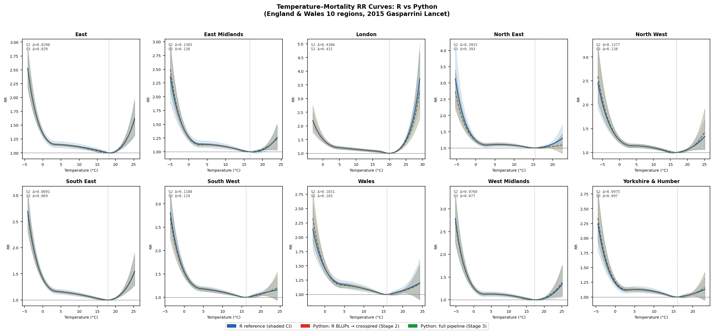

# PyDLNM: Distributed Lag Non-Linear Models in Python

PyDLNM is a Python implementation of distributed lag linear and non-linear models (DLMs/DLNMs) for modeling exposure-lag-response associations in epidemiological studies.

**Version 0.10** — Checked against R `dlnm` on three independent datasets (England & Wales, 106 US cities, Europe Summer 2022) and by a differential test suite that runs the same computation in R and in PyDLNM (`tests/`). The first-stage GLM, the cross-basis, `crosspred` and `crossreduce` agree with R at machine precision (~1e-14); the full pipeline including the Python meta-analysis (MVMeta → BLUP) agrees to about 1e-5, limited by the optimiser tolerance of R's own `mvmeta` (see below). v0.9 added support for natural-spline variable basis (`argvar={'fun':'ns'}`) and independent integer lag basis (`arglag={'fun':'integer'}`), enabling replication of weekly European epidemiological analyses. Note, however, that errors might still exist. BE CAREFUL!

> **v0.10 is the result of an audit** of the Python code against R (line-by-line review plus executable R-vs-Python tests, 252 findings, all verified findings fixed or documented). It changes some behaviour to follow R: see [Changes in v0.10](#changes-in-v010) before upgrading.

## Validation Status

### England & Wales (10 regions, Gasparrini *Lancet* 2015)

Validated via `test_against_r.py`:

| Stage | Description | Result |
|-------|-------------|--------|
| 1 | First-stage GLM coefficients | max\|Δcoef\| = 2.3e-14 (machine precision) |
| 2 | Prediction with R's BLUPs | max\|ΔRR\| = 4e-14 (machine precision) |
| 3 | Full pipeline (MVMeta → BLUP → RR curves) | max\|ΔRR\| = 1.4e-5, max\|ΔBLUP\| = 6e-6, corr = 1.000000 (optimiser-limited, see note below) |

*Stage 3 is not an exact match: R's `mvmeta` stops its `optim` (BFGS, `reltol` = 1.5e-8) before the REML optimum, so even R's own result changes by ~1e-5 between its default and a tight tolerance. PyDLNM's MVMeta agrees with a tightly converged R fit to about 1e-9 (1e-6 in the test suite) and with R's default fit to about 1e-5. `validation/test_against_r.py` asserts these levels.*



*Temperature–mortality RR curves for 10 England & Wales regions. Blue = R reference, red dashed = Python prediction using R's BLUPs, green dotted = full Python pipeline. Stages 1 and 2 agree with R at machine precision, the full pipeline to about 1e-5.*

### 106 US Cities

The full pipeline (first-stage GLMs → MVMeta → BLUP → RR curves) was run independently in both PyDLNM and R (`dlnm` + `mvmeta`) on a dataset of 106 US cities (1987–2000). Results were compared city by city on identical temperature grids (R's `round(seq(min, max, by = 0.1), 1)`):

| Metric | Result |
|--------|--------|
| Cities passing (max\|ΔRR\| < 0.05) | 106 / 106 |
| Median max\|ΔRR\| | 1.6e-6 (maximum over cities 1.1e-5) |
| Correlation (R vs Python) | 1.000000 for all 106 cities |
| MMT agreement | Identical in all 106 cities (0 unmatched grid points) |

The differences are the optimiser-limited meta-analysis level (see the England & Wales note). The scripts live in the git-ignored folder `temperature_mortality_analysis/` (they need the local `data.csv`). An earlier version of this table reported MMT differences in 22 cities and attributed them to the grid step; the real cause was an extra extrapolated grid point above the observed range in the Python script (`np.arange(min, max + 0.1, 0.1)` instead of R's `seq()`), which moved the MMT in 23 cities (one by 8.3 °C on a flat curve). The script now builds R's grid (`utils.seqlag`).

### Europe Summer 2022 Heat (103 NUTS regions, Ballester *Nature Medicine* 2023)

Validated via `validation/test_europe_2022.py` against R's `dlnm` + `mixmeta`. This dataset uses weekly data, natural-spline variable basis, and independent integer lags — settings not previously exercised in pydlnm.

| Stage | Description | Result |
|-------|-------------|--------|
| 1 | First-stage GLM coefficients (103 regions) | Exact match (max\|Δcoef\| < 2e-14) |
| 2 | MVMeta BLUPs | max\|ΔBLUP\| < 7e-7 |
| 3 | RR curves from BLUPs | max\|ΔRR\| < 9e-7, corr = 1.0 for all regions |
| 4 | Attributable numbers (point estimates, `att_val`), Summer 2022 | Total Heat AN: 7.5e-8 overall relative error, max 2.4e-6 per region (residual from the Stage 2 BLUP differences) |

> **Stage 4 scope and a correction:** Stage 4 checks the attributable-number *formula* of the Lancet `code.R` (inline in the validation script, using `OneBasis` + MVMeta BLUPs + MMT) on point estimates only. An earlier version of this table reported a 1.7% error and attributed it to Monte-Carlo sampling. That was wrong: point estimates involve no sampling. The validation script averaged *past* deaths over the lags, whereas R's `Lag(mort, -MIN_LAG:-MAX_LAG)` uses *future* deaths (forward window). With the forward window the point estimates agree with R to the level of the Stage 2 BLUP differences. `attribution.py` (`attrdl`, `attr_heat_cold`, ...) was rewritten in v0.10 as a port of R's `attrdl` and is covered by the differential tests; the Europe validation code itself is no longer in the repository.

> **R `crosspred` pitfall discovered during validation:** Calling `crosspred(crossbasis, model, coef=blup, vcov=blup_vcov)` in R silently ignores the user-supplied `coef`/`vcov` whenever a `model` is also passed — R extracts the model's own GLM estimates instead. The correct R usage for BLUP-based prediction is `crosspred(onebasis, coef=blup, vcov=blup_vcov)` (no model), as in Gasparrini's own `05.plots.R`. PyDLNM's reduced-coefficient path implements this correctly (single lag `[0, 0]`, like R's `onebasis` route) and matches R at machine precision.

## Implementation Strategy

PyDLNM uses R's statistical functions via `rpy2` for components where exact numerical agreement is critical, and native Python elsewhere.

### R-based (via rpy2)
- **GLM fitting**: `glm()` with quasi-Poisson family, natural spline seasonality, and day-of-week factors — formula: `death ~ cb + dow + ns(date, df=dfseas*nyears)`
- **Spline basis functions**: `splines::bs()` and `splines::ns()` with training boundary knots preserved for consistent out-of-range prediction

### Native Python
- **CrossBasis construction**: Vectorized tensor product of the variable and lag bases (whose spline columns come from R's `splines`)
- **CrossReduce**: Kronecker-product reduction to overall cumulative effects
- **CrossPred**: Lag-specific and overall cumulative predictions with confidence intervals
- **MVMeta**: REML multivariate meta-analysis with IGLS initialization and analytical gradient
- **BLUP**: Best Linear Unbiased Predictors with full uncertainty propagation

## Key Features

- **R compatibility**: first-stage GLM, cross-basis, `crosspred`, `crossreduce` and `attrdl` agree with R's `dlnm` at machine precision (~1e-14); the `mvmeta` stage agrees to about 1e-5 (optimiser tolerance, see Validation Status)
- **Basis functions**: B-splines, natural splines, linear, polynomial, threshold, strata and integer, in both cross-basis dimensions (the tests compare each against R)
- **Cross-basis matrices**: Tensor products for bi-dimensional exposure-lag modeling
- **Comprehensive predictions**: Lag-specific, overall cumulative, and predictor-specific effects
- **Multi-location meta-analysis**: REML MVMeta with meta-regression and BLUPs
- **Boundary knot preservation**: B-spline bases store training-data range for consistent prediction

## Changes in v0.10

The audit compared the Python code with R's `dlnm`/`mvmeta` line by line and with executable differential tests. Behaviour that followed R incorrectly was changed to follow R; code that is not (yet) equivalent to R is documented below. Things to check when upgrading from v0.9:

- **`crosspred` centering**: `cen=None` now centres at `median(pretty(range))` for bs/ns/poly bases (R's `mkcen`), with a message; use `cen=False` for no centering. `cen=True/False` are logical (ignored for lin/strata/thr/integer; no centering if the basis has an intercept). The default prediction grid is R's `pretty(range, n=50)`, `from`/`to`/`by` follow R's `mkat` (never beyond `to`), `at` is sorted and made unique, and an exposure-history matrix `at` is supported.
- **`CrossBasis` defaults and arguments**: an empty `arglag` (or a single lag) now gives R's default lag basis `strata(df=1, intercept=TRUE)` (one unconstrained column), not `ns` with log-knots; the `argvar`/`arglag` you pass are copied and then redefined from the fitted bases (resolved knots, boundary knots, poly scale, strata breaks, threshold), so `crosspred`/`crossreduce` rebuild the training basis instead of re-deriving it from the prediction grid. Every `fun` (`lin`, `poly`, `ns`, `bs`, `strata`, `thr`, `integer`, callables) and `intercept` is honoured in both dimensions; unknown keyword arguments raise; R's spellings (`Boundary.knots`, `thr.value`, `type=`) are accepted; `mklag` rounds and `seqlag` never overshoots like R; negative lags, lag matrices and `group=` work as in R.
- **`crossreduce`** is a port of R's function: `type` overall/var/lag, `value`, `at`, `lag`, `bylag`, `cen`, `ci_level`, `model_link`, and the returned object has `basis`, `fit`, `se`, `RRfit`/`RRlow`/`RRhigh` (or `low`/`high`) and `summary()`. `reduction_type=` is a deprecated alias of `type`.
- **Model coefficients** are selected **by name** (`v1.l1`, ... as R does) and the link is detected for statsmodels models. Unnamed designs whose cross-basis block cannot be identified raise an error asking for explicit `coef=`/`vcov=` instead of guessing the first columns. `coef`/`vcov` with NaN or the wrong size raise R's "not consistent with basis matrix" error.
- **`attrdl`** (`attribution.py`) is a port of R's `attrdl` (forward/backward perspective, cases attributed over the lag window, totals rescaled to the observed cases, `range` semantics, simulation). `cen` must be given (or be stored in the basis); `coef`/`vcov` passed without a model are log-scale coefficients. `attr_heat_cold` splits at the centering value by default.
- **`find_mmt_blup`** follows the Lancet recipe and raises instead of silently returning the median temperature.
- **R is not reconfigured by the library any more**: `improved_glm.py`/`rpy2_glm.py` no longer overwrite `R_HOME`, and the spline wrappers no longer write objects into R's global environment.

## Experimental modules

`penalized.py` (penalized cross-basis / penalized DLNM) and `seasonality.py` have no validated counterpart in R's `dlnm` and have open issues found by the audit (for example the REML criterion and smoothing-parameter selection of `penalized.py`, and the treatment of dates and of the cyclic spline in `seasonality.py`). They warn when used. Do not rely on them for published analyses.

## Tests

`tests/` is a differential test suite: each test runs the same computation in R (`dlnm`, `mvmeta`/`mixmeta`, via rpy2) and in PyDLNM and compares the numbers (reference values are computed by R at test time). See `tests/README.md`:

```bash
python -m pytest tests -q      # needs R with dlnm, tsModel, mvmeta, mixmeta and a rpy2 that can start it
```

Tests named after an audit finding carry `known_defect(...)` (a strict `xfail`) while the defect is open; the marker is removed in the commit that fixes it. `validation/test_against_r.py` is the England & Wales end-to-end check (it asserts each stage at the agreement level stated above).

## Installation

```bash
git clone https://github.com/aedessler/pydlnm
cd pydlnm
pip install rpy2 numpy scipy pandas statsmodels scikit-learn
```

Requires R with the `dlnm` and `splines` packages (and `tsModel`, `mvmeta`, `mixmeta` for the tests and the R comparisons). PyDLNM never changes `R_HOME`: set it **before importing** if the R on your `PATH` is not the right one (for example an R version that rpy2 cannot start, or one without `dlnm`):

```bash
export R_HOME=/Library/Frameworks/R.framework/Resources
```

The modules are flat files (`from basis import CrossBasis`); run from the repository directory or add it to `PYTHONPATH`.

## Quick Start

### Single-Location DLNM

```python
import numpy as np
import pandas as pd
from basis import CrossBasis
from improved_glm import ImprovedGLMInterface
from prediction import crosspred
from utils import logknots

# Load your data
df = pd.read_csv('your_data.csv')
df['date'] = pd.to_datetime(df['date'])

# Build cross-basis (B-spline on temperature × natural spline on lag)
knots_var = np.quantile(df['tmean'].dropna(), [0.10, 0.75, 0.90])
lag_knots  = logknots([0, 21], nk=3)

cb = CrossBasis(
    x=df['tmean'].values,
    lag=21,
    argvar={'fun': 'bs', 'knots': knots_var, 'degree': 2},
    arglag={'fun': 'ns', 'knots': lag_knots}
)

# Fit quasi-Poisson GLM
glm = ImprovedGLMInterface(cb)
glm.fit_dlnm_model(y=df['death'].values, dates=df['date'],
                   dfseas=8, family='quasipoisson')

# Predict RR curve
pred_temps = np.arange(df['tmean'].min(), df['tmean'].max(), 0.5)
cen = float(df['tmean'].mean())

pred = crosspred(basis=cb,
                 coef=glm.cb_coef, vcov=glm.cb_vcov,
                 model_link='log',
                 at=pred_temps, cen=cen)

print(f"RR range: {pred.allRRfit.min():.3f} to {pred.allRRfit.max():.3f}")
```

### Multi-Location Analysis with MVMeta

```python
from meta_analysis import MVMeta, blup

# `data` is a dict {location: DataFrame with columns tmean, death, date} (one DataFrame per location)
locations = list(data)
coef_list, vcov_list, cb_list, cen_list = [], [], [], []

# --- First stage: fit one model per location ---
for location in locations:
    df = data[location]
    cb_i = CrossBasis(
        x=df['tmean'].values, lag=21,
        argvar={'fun': 'bs', 'degree': 2,
                'knots': np.quantile(df['tmean'].dropna(), [0.10, 0.75, 0.90])},
        arglag={'fun': 'ns', 'knots': logknots([0, 21], nk=3)})
    glm_i = ImprovedGLMInterface(cb_i)
    glm_i.fit_dlnm_model(y=df['death'].values, dates=pd.to_datetime(df['date']), dfseas=8)
    cen_i = float(df['tmean'].mean())
    red = glm_i.crossreduce(cen=cen_i)
    coef_list.append(red.coef)
    vcov_list.append(red.vcov)
    cb_list.append(cb_i)
    cen_list.append(cen_i)

# --- Second stage: MVMeta with meta-regression ---
# IMPORTANT: include an explicit intercept column in X
avg_temps = np.array([data[l]['tmean'].mean() for l in locations])
temp_ranges = np.array([data[l]['tmean'].max() - data[l]['tmean'].min() for l in locations])
X_meta = np.column_stack([
    np.ones(len(locations)),   # intercept — required!
    avg_temps,
    temp_ranges
])

mv = MVMeta()
mv.fit(y=np.vstack(coef_list), S=np.stack(vcov_list), X=X_meta)
blup_results = blup(mv)

# --- Predict RR curves from BLUPs (reduced coefficients: R's crosspred(onebasis, coef, vcov)) ---
for i, location in enumerate(locations):
    pred = crosspred(basis=cb_list[i],
                     coef=blup_results[i]['blup'],
                     vcov=blup_results[i]['vcov'],
                     model_link='log',
                     at=pred_temps, cen=mmt_i)       # mmt_i: the minimum-mortality temperature of location i
```

> **Note**: PyDLNM's `MVMeta` does not auto-add an intercept. Always include a column of ones in `X` when using meta-regression covariates, matching R's default formula behaviour (`~ x1 + x2` includes an intercept automatically).

## Project Structure

```
.
├── basis.py              # OneBasis, CrossBasis (+ onebasis()/crossbasis() functions)
├── basis_functions.py    # lin, poly, ns, bs, strata, thr (integer, ...) basis functions
├── enhanced_splines.py   # bs/ns variants with extra attributes
├── prediction.py         # CrossPred / crosspred, mkat, mkcen, mkxpred
├── crossreduce.py        # CrossReduce / crossreduce: overall, var and lag reductions
├── centering.py          # MMT search (find_mmt, find_mmt_blup), re-centering
├── attribution.py        # attrdl (port of R's attrdl), heat/cold and percentile wrappers
├── meta_analysis.py      # MVMeta (REML/ML) + BLUP
├── multi_location.py     # MultiLocationDLNM workflow (first stage + meta-analysis + pooled MMT)
├── improved_glm.py       # GLM fitting via R (quasi-Poisson + seasonality), ImprovedGLMInterface
├── rpy2_glm.py, glm_integration.py   # older GLM interfaces
├── model_utils.py        # getcoef / getvcov / getlink (coefficients selected by name)
├── utils.py              # mklag, seqlag, pretty, logknots, equalknots, exphist, lagmatrix
├── penalized.py, seasonality.py      # EXPERIMENTAL (not validated against R)
├── tests/                # R-vs-PyDLNM differential test suite (see tests/README.md)
└── validation/
    ├── test_against_r.py        # End-to-end 3-stage validation (England & Wales), asserts each stage
    ├── plot_rr_comparison.py    # RR curve comparison plot generator
    ├── generate_r_reference.R   # Regenerates England & Wales reference data
    ├── reference_data/          # R reference outputs (BLUPs, RR CSVs)
    └── rr_comparison_R_vs_Python.png
```

## Based on R dlnm Package

This Python implementation is based on the R `dlnm` package by Antonio Gasparrini and colleagues:

- Gasparrini A. Distributed lag linear and non-linear models in R: the package dlnm. *Journal of Statistical Software*. 2011; **43**(8):1-20.
- Gasparrini A, Scheipl F, Armstrong B, Kenward MG. A penalized framework for distributed lag non-linear models. *Biometrics*. 2017; **73**(3):938-948.
- Gasparrini A et al. Mortality risk attributable to high and low ambient temperature. *The Lancet*. 2015; **386**(9991):369-375.
- Ballester J et al. Heat-related mortality in Europe during the summer of 2022. *Nature Medicine*. 2023; **29**:1857–1866.

R reference code from [Gasparrini's GitHub](https://github.com/gasparrini/2015_gasparrini_Lancet_Rcodedata).

## License

GPL-2.0-or-later
